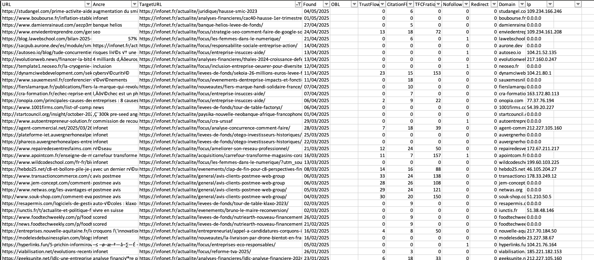

# Automated news article generation workflow 

## Description

This proposal outlines an automated workflow designed to generate multiple topical news articles daily for the Sortlist blog. The goal is to leverage AI to rewrite and enrich relevant news content, aiming to increase organic traffic through SERP visibility, Google News, and Google Discover. This workflow currently relies on two core Python scripts.

## Scripts involved

1.  **`Crawl/Scripts/news_blog_generator.py`**:
    *   **Functionality**: Fetches recent news articles for predefined `TOPICS` using the SerpAPI (Google News engine).
    *   Evaluates the relevance of each fetched article (Title, Meta snippet) for the Sortlist blog using an OpenAI model (`o3-mini` currently) based on specific criteria (marketing, digital, agencies, etc., avoiding politics, local news, etc.).
    *   Outputs a list of relevant articles (Title, Meta, URL, Relevance=Yes/No) to a CSV file (`news_articles_with_relevance.csv`).
    *   **Current Limitation**: Only fetches snippets, not full content, and relies on SerpAPI. Relevance check is basic (Yes/No).

2.  **`Crawl/Scripts/news_blog_article_generator.py`**:
    *   **Functionality**: Takes a *single*, pre-existing HTML file (e.g., [`/Volumes/T7/sortlist/sortlist-analyzer/data/article_main_example.html`](../../sortlist-analyzer/data/article_main_example.html)) as its source input.
    *   Injects the *entire HTML content* of this source file into a detailed prompt.
    *   Uses an OpenAI model (`o3-2025-04-16` currently, configured via the new client API) to deeply rewrite and enrich the source content into a new press article in HTML format, following strict constraints (topic adherence, data sourcing, formatting).
    *   Saves the generated article to a new file (e.g., [`/Volumes/T7/sortlist/sortlist-analyzer/data/article_main_rewritten.html`](../../sortlist-analyzer/data/article_main_rewritten.html)).
    *   **Current Limitation**: Processes only *one* static input file per execution, requiring manual preparation of this file.

## Current workflow & limitations

The current process requires significant manual intervention between the two scripts:

1.  Run `news_blog_generator.py` to generate the `news_articles_with_relevance.csv`.
2.  **Manual Step**: Review the CSV and select a relevant article URL. (Note: This step could potentially be automated using a script, e.g., leveraging a DeepSeek model on a server, incurring only server costs).
3.  **Manual Step**: Manually retrieve the full HTML content of the selected article from its URL. (Note: The core requirement is to extract the main content, possibly using tools like `requests` or `BeautifulSoup`, and potentially needing to handle paywalls or hidden content).
4.  **Manual Step**: Save this retrieved HTML into the static input file (`article_main_example.html`). (Note: This is easily automatable).
5.  Run `news_blog_article_generator.py` to generate *one* rewritten article based on the prepared input file.

This workflow is not scalable for generating XX articles daily and depends heavily on manual steps.

## Proposed Enhancements & Future Roadmap

To achieve the goal of automated daily generation of XX articles, the following enhancements are proposed:

1.  **Full automation & integration**:
    *   Modify `news_blog_generator.py` (or create an orchestrator script) to not just identify relevant URLs but also trigger the retrieval of their full content.
    *   Implement robust content retrieval logic to fetch the full HTML from selected news URLs. This must address:
        *   **JavaScript Rendering**: Use tools capable of rendering JS (e.g., `requests-html`, `playwright`, `selenium`).
        *   **Paywalls/Hidden Content**: Implement strategies to detect and either bypass (if ethically/technically feasible) or filter out articles behind hard paywalls or with inaccessible content. Consider using scraping APIs or proxies if needed.
    *   Pipe the retrieved full HTML content dynamically into the prompt logic of `news_blog_article_generator.py` (or integrate its core generation logic), removing the dependency on the static `article_main_example.html` file.

2.  **News source diversification**:
    *   Evaluate and potentially integrate alternative news sources beyond SerpAPI (e.g., official Google News API, direct scraping of reputable sources with proper proxy management and ethical considerations).

3.  **Relevance refinement**:
    *   Improve the relevance assessment. Explore using more sophisticated checks or potentially leverage local/free models (e.g., DeepSeek, as mentioned) for cost-effective analysis before potentially sending to a paid generation model.

4.  **Content strategy focus for SEO & backlinks**:
    *   **Dedicated Agency News Section**: Prioritize fetching and generating content specifically about **agency news (mergers, acquisitions, funding rounds, major client wins)**. This type of content is highly relevant to the Sortlist audience and has strong potential to attract **natural backlinks** from industry publications and the agencies themselves.
    *   **Company Marketing News**: Similarly, cover significant marketing news, campaigns, or strategy shifts from notable companies. This can also generate interest and potential **backlinks** from marketing professionals and news outlets.

    *Example of backlinks earned through AI-generated news:* 
    

    *Recent LinkedIn mentions potentially driven by this type of content:* 
    | URL                                                                                                                                                                                             | Company                             | Date         |
    |-------------------------------------------------------------------------------------------------------------------------------------------------------------------------------------------------|-------------------------------------|--------------|
    | https://www.linkedin.com/posts/les-trophees-des-futures-licornes_29-millions-deuros-lev%C3%A9s-avec-woven-capital-activity-7293202188300914688-GkdI?utm_source=share&utm_medium=member_desktop | Les Trophées des Futures Licornes | February 2025 |
    | https://www.linkedin.com/posts/anne-ga%C3%ABlle-fonthieure_valtom-waga-15-gwh-de-bio-%C3%A9nergie-inject%C3%A9s-activity-7285235085853794304-PsC7?utm_source=share&utm_medium=member_desktop      | Waga Energy                         | January 2025 |
    | https://www.linkedin.com/posts/trendeo_investissements-industriels-2024-le-tournant-activity-7302235665755230208-TjpK/?utm_source=share&utm_medium=member_desktop                                 | Trendéo                             | March 2025   |
    | https://www.linkedin.com/posts/msinsight_msinsight-16-m-pour-r%C3%A9volutionner-le-activity-7306251173601148929-0nsr?utm_source=share&utm_medium=member_desktop                                | MS Insight                          | March 2025   |
    | https://www.linkedin.com/posts/camille-decreux_fiers-la-marque-handi-solidaire-qui-grandit-activity-7305255931670323201-hkQF?utm_source=share&utm_medium=member_desktop                          | Fiers                               | April 2025   |
    | https://www.linkedin.com/posts/stephanie-nock_bonne-surprise-de-voir-othentis-mis-en-lumi%C3%A8re-activity-7322888639686819842-CAAR/?utm_source=share&utm_medium=member_desktop                       | Othentis                            | April 2025   |
    | https://www.linkedin.com/posts/cedric-prins-a28442282_sam-la-r%C3%A9volution-phygitale-infonet-activity-7320500017142665216-JWHL/?utm_source=share&utm_medium=member_desktop                           | Sam                                 | April 2025   |

5.  **Model testing & optimization**:
    *   Systematically test different AI generation models (e.g., various GPT versions, Claude, Gemini) to find the optimal balance between content quality, generation speed, adherence to constraints, and cost.

6.  **Scheduling & automation**:
    *   Set up a cron job or similar scheduler to run the fully automated workflow daily to generate the target number (XX) of articles.

7.  **Monitoring**:
    *   Implement tracking to measure the organic traffic impact (SERP, News, Discover) of the generated articles, paying particular attention to referral traffic and backlink acquisition from the focused news sections.

## Expected benefits

-   **Scalability**: Enables automatic generation of multiple articles per day.
-   **Efficiency**: Drastically reduces manual effort in content sourcing and preparation.
-   **Content Freshness**: Keeps the blog updated with relevant, timely news.
-   **Traffic Growth**: Potential to significantly increase organic traffic via various channels.

