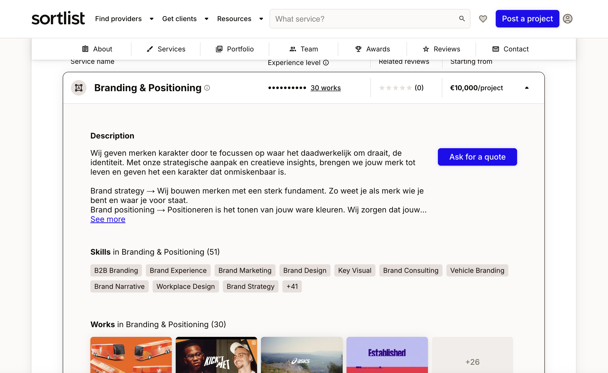
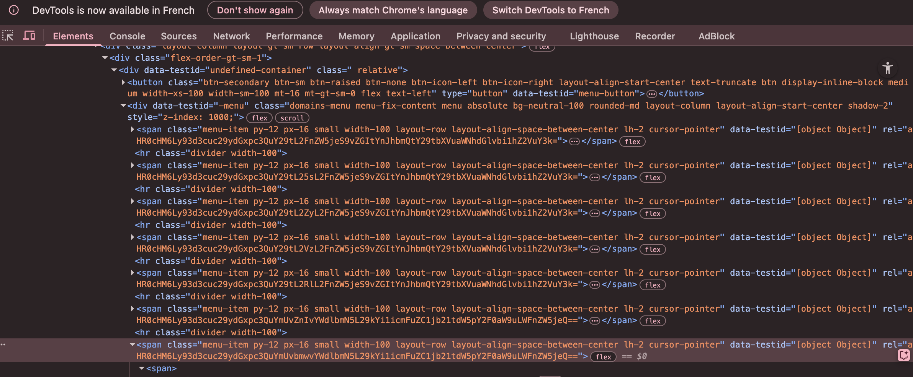

# Issue: Mixed language content in URLs and inconsistent hreflang implementation

## Description
There are instances where page content is not in the language suggested by the URL path or TLD. For example, English content might be served on URLs with an `/es/` path, or as shown in another example below, Dutch text can appear on a page primarily targeting English.

A clear example of mixed language content (English content on an `/es/` path) can be seen in the screenshot below:


Another example shows a page targeting English (`https://www.sortlist.com/agency/odb-brand-communication-agency`) but containing significant portions of Dutch text:


Currently, multiple versions of agency pages are available under different country/language paths or TLDs. For instance, pages like:
[`https://www.sortlist.com/agency/dem-diseno-estrategico-de-marca`]
and
[`https://www.sortlist.com/agency/odb-brand-communication-agency`]

This page, and others like it, list a large set of `<link rel="alternate" hreflang="...">` declarations pointing to other localized versions, such as:
```html
<link rel="alternate" href="https://www.sortlist.com/nl/agency/dem-diseno-estrategico-de-marca" hreflang="nl"/>
<link rel="alternate" href="https://www.sortlist.com/fr/agency/dem-diseno-estrategico-de-marca" hreflang="fr"/>
<link rel="alternate" href="https://www.sortlist.com/es/agency/dem-diseno-estrategico-de-marca" hreflang="es"/>
<link rel="alternate" href="https://www.sortlist.de/agency/dem-diseno-estrategico-de-marca" hreflang="de-de"/>
<link rel="alternate" href="https://www.sortlist.us/agency/dem-diseno-estrategico-de-marca" hreflang="en-us"/>
<!-- etc. -->
```

While a broad hreflang setup is good in principle, the current implementation has several flaws, particularly concerning the actual content served on these "localized" URLs.

## Issues identified

1.  **Mixed Content Language**: The primary issue is that many pages declared as translations (e.g., via `/es/` path or `hreflang="es"`) serve content in a different language (commonly English) instead of the expected localized content. This contradicts the URL and hreflang signals.
2.  **Alternate versions not consistently internally linked**: Language selectors or footer links to all declared alternate versions are often missing, making them effectively orphaned from a user/crawler perspective if not for sitemaps or direct hreflang crawling.
3.  **Potentially misleading auto-translation handling**: If auto-translation is used, it's not always clearly declared or handled in a way that prevents near-duplicate content appearing across different language URLs signaled by hreflang.
4.  **Redundant or inconsistent hreflang declarations**: This includes regional variants like `fr-be`, `nl-be`, `de-de` that may serve identical or near-identical content to their generic language counterparts, or incorrect `hreflang` values.
5.  **Language Selector Links Obfuscated/Dynamically Generated**: Evidence suggests the links in the language/version selector (e.g., in the site footer) are not implemented as standard, directly crawlable `<a>` tags with `href` attributes. Instead, they may be generated by JavaScript or use encoded/non-standard attributes (e.g., relying on `data-testid` for functionality, as suggested by code inspection). This can hinder search engines from easily crawling these critical links to discover alternate language versions, forcing an over-reliance on sitemaps and `hreflang` tags for inter-linking signals. This is particularly suboptimal given these alternative URLs are declared in sitemaps.

    *Visual evidence of the language selector and its underlying code:*
    
    

## SEO impact

- **User Experience**: Serves confusing and potentially unhelpful content to users (e.g., Spanish-speaking user lands on an `/es/` page with English content).
- **Diluted Indexing Signals**: Splits authority across multiple URLs that should ideally consolidate signals for a single piece of content tailored to specific languages/regions.
- **Risk of Duplicate Content**: Search engines may view non-translated or poorly translated pages as duplicate content, especially across ccTLDs or different language paths if the content is too similar.
- **Wasted Crawl Budget**: Crawlers may spend resources on pages that don't offer unique value or correct language targeting.
- **Ineffective Hreflang**: The intended benefits of `hreflang` (serving the correct language/regional URL) are undermined if the content itself doesn't match the signal.
- **Reduced Crawlability of Alternate Versions**: If language selector links are not easily crawlable (due to JavaScript generation or non-standard linking), it impedes Google's ability to discover and understand the site's international structure through internal linking. This can weaken the signals provided by `hreflang` and sitemaps, as on-page linking is a strong confirmatory signal.

## Recommendation

1.  **Ensure Content-Language-URL Alignment**: Prioritize ensuring that the content of a page matches the language indicated by its URL path (e.g., `/es/` URLs must have Spanish content).
2.  **Accurate Hreflang Implementation**:
    *   Limit `hreflang` tags to genuinely localized and valuable versions only. Do not declare alternates if the content is not properly translated and adapted.
    *   Audit and remove incorrect, broken, or unnecessary `hreflang` entries.
    *   Ensure all `href` and `hreflang` values are correct, without duplication or empty attributes.
3.  **Implement Comprehensive and Crawlable Internal Linking for Language Versions**:
    *   Use clear language selectors (e.g., footer links, flags) that link to all *correctly localized* alternate versions.
    *   Crucially, ensure these language selector links are implemented as standard, static `<a>` tags with direct `href` attributes. Avoid JavaScript-dependent links or non-standard attributes that might obscure them from search engine crawlers.
4.  **Invest in a Robust Translation Strategy**: Instead of relying on potentially low-quality auto-translations and then using `noindex` as a workaround, prioritize a sound translation strategy. Current AI-powered translation tools (whether through APIs or local AI models) offer cost-effective ways to achieve high-quality, contextually relevant translations. This approach ensures a better user experience and stronger SEO signals for localized content.

## Optional: Implement `x-default`
For a global fallback (typically the main `.com` site in a primary language like English), use `hreflang="x-default"`:
```html
<link rel="alternate" href="https://www.sortlist.com/agency/dem-diseno-estrategico-de-marca" hreflang="x-default"/>
```

---

Addressing these issues will:
- Significantly improve user experience for international visitors.
- Enhance crawl efficiency and reduce index bloat.
- Mitigate risks of duplicate content.
- Strengthen the overall international SEO architecture and the effectiveness of `hreflang` signals.

Why are the FAQs https://www.sortlist.com/s/inbound-marketing/france-fr in French here and in English here https://www.sortlist.com/s/inbound-marketing/paris-fr? I imagine it's a content generation error.

