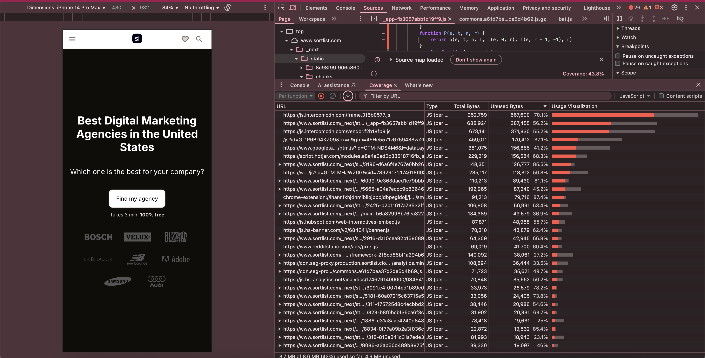
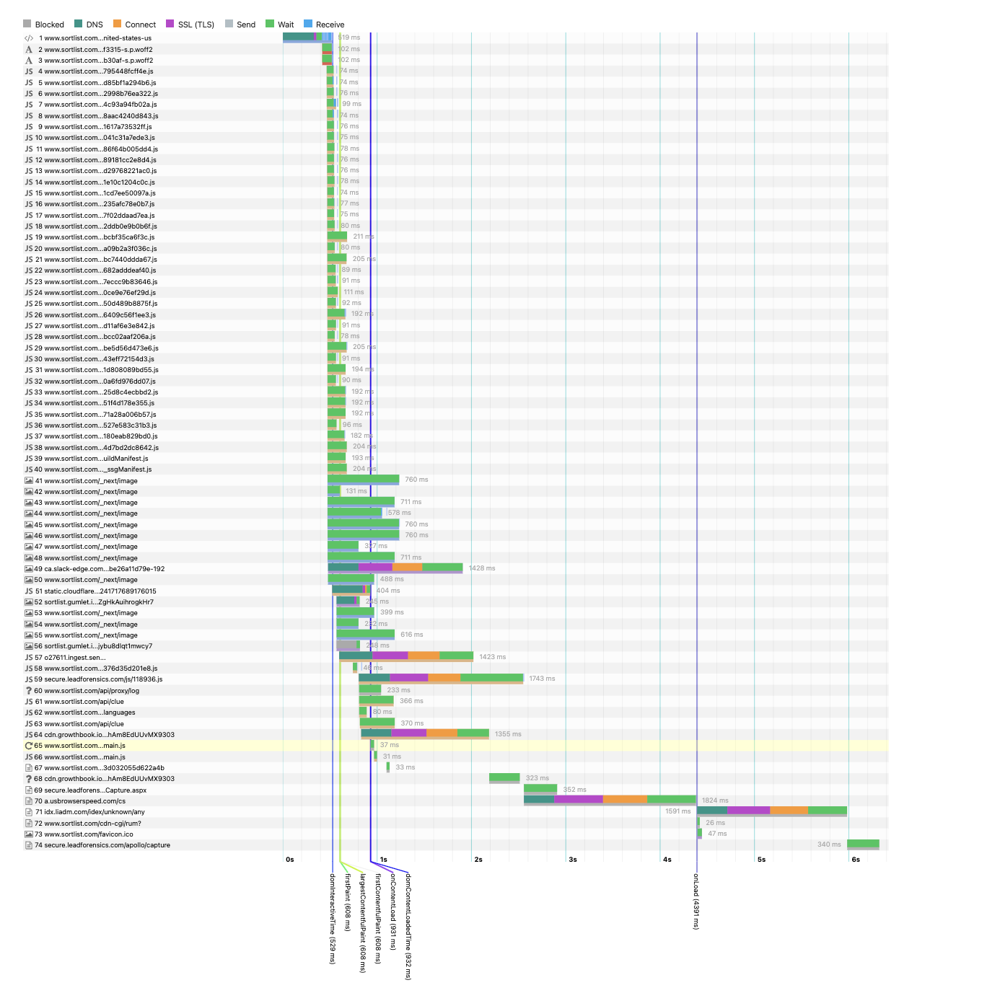

# Performance optimization: Addressing excessive JavaScript payload

## Issue overview

Analysis of the page `https://www.sortlist.com/digital-marketing/united-states-us` reveals an excessive JavaScript payload.
The page currently loads approximately **745.1 KB** of compressed JavaScript, which expands to **2.1 MB** uncompressed. These figures exceed recommended thresholds for optimal web performance.

This excessive payload negatively impacts page load times and user experience, particularly on mobile devices. It also adversely affects Core Web Vitals scores, which are a Google ranking factor.

---

## Analysis of JavaScript payload

A detailed review of the JavaScript assets loaded by the page identifies several large files contributing to the overall payload. The primary offenders are listed below:

| URL                                                                 | Transfer size | Content size |
|---------------------------------------------------------------------|---------------|--------------|
| https://www.sortlist.com/_next/static/chunks/webpack-e237795448fcff4e.js | 5.4 KB        | 9.0 KB       |
| https://www.sortlist.com/_next/static/chunks/framework-218cd85bf1a294b6.js | 47.5 KB       | 136.8 KB     |
| https://www.sortlist.com/_next/static/chunks/main-b6a82998b76ea322.js | 41.6 KB       | 131.2 KB     |
| https://www.sortlist.com/_next/static/chunks/pages/_app-dfc94c93a94fb02a.js | 216.4 KB      | 673.0 KB     |
| https://www.sortlist.com/_next/static/chunks/1886-e31a8aac4240d843.js | 27.2 KB       | 76.6 KB      |
| https://www.sortlist.com/_next/static/chunks/2425-b2b11617a73532ff.js | 36.8 KB       | 105.5 KB     |
| https://www.sortlist.com/_next/static/chunks/318-816e041c31a7ede3.js | 28.6 KB       | 80.1 KB      |
| https://www.sortlist.com/_next/static/chunks/6577-2cec86f64b005dd4.js | 5.3 KB        | 10.6 KB      |
| https://www.sortlist.com/_next/static/chunks/5154-f8cf89181cc2e8d4.js | 4.7 KB        | 14.2 KB      |
| https://www.sortlist.com/_next/static/chunks/5353-b7f5d29768221ac0.js | 3.2 KB        | 5.0 KB       |
| https://www.sortlist.com/_next/static/chunks/9240-04d91e10c1204c0c.js | 5.3 KB        | 12.4 KB      |
| https://www.sortlist.com/_next/static/chunks/4783-74da1cd7ee50097a.js | 1.6 KB        | 2.5 KB       |
| https://www.sortlist.com/_next/static/chunks/3968-7b1f235afc78e0b7.js | 12.2 KB       | 30.9 KB      |
| https://www.sortlist.com/_next/static/chunks/6013-bec77f02ddaad7ea.js | 6.3 KB        | 14.4 KB      |
| https://www.sortlist.com/_next/static/chunks/8784-35a62ddb0e9b0b6f.js | 3.2 KB        | 6.8 KB       |
| https://www.sortlist.com/_next/static/chunks/323-b8f0bcbf35ca6f3c.js | 11.7 KB       | 31.2 KB      |
| https://www.sortlist.com/_next/static/chunks/8834-0f77a09b2a3f036c.js | 8.1 KB        | 22.3 KB      |
| https://www.sortlist.com/_next/static/chunks/6147-cfbcbc7440ddda67.js | 8.7 KB        | 21.0 KB      |
| https://www.sortlist.com/_next/static/chunks/3269-65a1682adddeaf40.js | 6.0 KB        | 12.9 KB      |
| https://www.sortlist.com/_next/static/chunks/5665-a04a7eccc9b83646.js | 72.0 KB       | 198.7 KB     |
| https://www.sortlist.com/_next/static/chunks/3980-8b6a0ce9e76ef29d.js | 6.7 KB        | 14.8 KB      |
| https://www.sortlist.com/_next/static/chunks/8086-a3ab50d489b8875f.js | 11.8 KB       | 38.4 KB      |
| https://www.sortlist.com/_next/static/chunks/3596-71556409c56f1ee3.js | 9.5 KB        | 32.8 KB      |
| https://www.sortlist.com/_next/static/chunks/5758-dd6dd11af6e3e842.js | 8.4 KB        | 24.0 KB      |
| https://www.sortlist.com/_next/static/chunks/9255-d3ccbcc02aaf206a.js | 4.0 KB        | 9.3 KB       |
| https://www.sortlist.com/_next/static/chunks/4915-78e5be5d56d473e6.js | 16.7 KB       | 54.7 KB      |
| https://www.sortlist.com/_next/static/chunks/3395-19ab43eff72154d3.js | 3.7 KB        | 7.7 KB       |
| https://www.sortlist.com/_next/static/chunks/6384-e64b1d808089bd55.js | 8.6 KB        | 27.4 KB      |
| https://www.sortlist.com/_next/static/chunks/8755-1c310a6fd976dd07.js | 8.0 KB        | 19.7 KB      |
| https://www.sortlist.com/_next/static/chunks/311-175725d8c4ecbbd2.js | 10.8 KB       | 37.5 KB      |
| https://www.sortlist.com/_next/static/chunks/1354-1fc851f4d178e355.js | 9.3 KB        | 25.8 KB      |
| https://www.sortlist.com/_next/static/chunks/5988-0f4271a28a006b57.js | 11.0 KB       | 26.5 KB      |
| https://www.sortlist.com/_next/static/chunks/4112-abcc527e583c31b3.js | 9.4 KB        | 26.9 KB      |
| https://www.sortlist.com/_next/static/chunks/6053-6328180eab829bd0.js | 14.8 KB       | 41.9 KB      |
| https://www.sortlist.com/_next/static/chunks/pages/%5B...custom%5D-df354d7bd2dc8642.js | 10.0 KB       | 26.5 KB      |
| https://www.sortlist.com/_next/static/72e27bc2acbc4d6ed3a55e36b4755b014c70d795/_buildManifest.js | 3.6 KB        | 10.0 KB      |
| https://www.sortlist.com/_next/static/72e27bc2acbc4d6ed3a55e36b4755b014c70d795/_ssgManifest.js | 830 B         | 91 B         |
| https://static.cloudflareinsights.com/beacon.min.js/vcd15cbe7772f49c399c6a5babf22c1241717689176015 | 7.0 KB        | 19.5 KB      |
| https://www.sortlist.com/_next/static/chunks/5413.25eb376d35d201e8.js | 5.5 KB        | 13.5 KB      |
| https://secure.leadforensics.com/js/118936.js                       | 11.6 KB       | 25.3 KB      |
| https://www.sortlist.com/cdn-cgi/challenge-platform/h/b/scripts/jsd/701fd2559006/main.js? | 4.5 KB        | 8.2 KB       |

*This data was gathered using standard browser developer tools.*

---

## Technical findings

Examination using browser developer tools reveals several key points:

-   A significant portion of the code within the loaded JavaScript files is not utilized on initial page load, as indicated by coverage reports. This suggests that non-essential code is being delivered to the client.

    
    *Above: A screenshot from the Chrome DevTools Coverage tab for the analyzed page. The overall JavaScript coverage is approximately 43.8%, indicating that a substantial amount of loaded JavaScript isn't used initially. For example, the primary `_app-...js` bundle (the first item in the list, `_app-fb3657abb1d19ff9.js`) shows that out of 952.8KB (Total Bytes), about 667.6KB (Unused Bytes) are unused, which is roughly 70.1%. The red sections in the "Usage Visualization" column clearly highlight this unused code that's being downloaded but not immediately executed.*

-   Some JavaScript functionalities appear to execute only after user interaction. This indicates potential for lazy-loading strategies to defer the loading of such scripts until they are actively required.
-   Certain external scripts, such as those from `leadforensics.com` and `cloudflareinsights.com`, are loaded eagerly. Deferring these scripts could improve initial page load performance.
-   The network waterfall chart below further illustrates the loading sequence and timing of resources, highlighting the download times for various JavaScript assets and the point at which key page load milestones (like First Contentful Paint and DOMContentLoaded) occur. This visual representation helps to pinpoint render-blocking resources and opportunities for deferral or optimization.

    
    *Above: Network waterfall chart showing the resource loading sequence for the analyzed page. Note the load times of individual JavaScript files and their relation to critical rendering path milestones.*

---

## Recommended actions

The following actions are recommended to optimize JavaScript payload and improve performance:

1.  **Audit and tree-shake components:**
    *   Utilize tools like `@next/bundle-analyzer` to analyze the composition of primary JavaScript bundles (e.g., `_app.js`) and shared dependencies.
    *   Identify and either remove or dynamically import (using `dynamic()` imports) features or components not essential for initial page rendering on all pages.

2.  **Implement efficient loading strategies for external scripts:**
    *   Leverage the Next.js `<Script>` component with appropriate loading strategies (e.g., `lazyOnload` or `afterInteractive`) for external scripts.
    *   Example for a deferred script:
        ```tsx
        <Script src="https://secure.leadforensics.com/js/118936.js" strategy="lazyOnload" />
        ```

3.  **Enhance code splitting:**
    *   Employ `dynamic()` imports more aggressively for heavy components that are not required for the initial viewport or above-the-fold content.
    *   Ensure that JavaScript logic specific to certain routes or components is not unnecessarily included in common bundles loaded on unrelated pages.

4.  **Conduct deeper analysis with source maps (if available):**
    *   If build process access and source maps are available, use tools like `source-map-explorer` to gain a more granular understanding of module contributions to bundle sizes.

---

## Recommended tools

-   `@next/bundle-analyzer` (for analyzing JavaScript bundle contents)
-   Chrome DevTools (specifically the Coverage tab)
-   Lighthouse or WebPageTest (for overall performance testing)
-   `source-map-explorer` (if source map files are accessible)

---

## Expected benefits

Addressing these issues is expected to yield the following improvements:

-   Reduction in Total Blocking Time (TBT).
-   Faster Time to Interactive (TTI).
-   Improved Largest Contentful Paint (LCP) and overall PageSpeed scores.
-   Smaller build sizes and enhanced perceived performance for users.


## Further reading & resources

For more information on optimizing resource loading, the following Google Developer documentation is a valuable resource:

-   [Keep request counts low and transfer sizes small](https://developer.chrome.com/docs/lighthouse/performance/resource-summary) - This guide explains the impact of network payloads on performance and provides further optimization tips.
-   [Tree shaking](https://developer.mozilla.org/en-US/docs/Glossary/Tree_shaking) - An explanation from MDN Web Docs about tree shaking, a process for removing unused code (dead code elimination) in JavaScript, which is relevant to the recommendation for auditing and tree-shaking components.