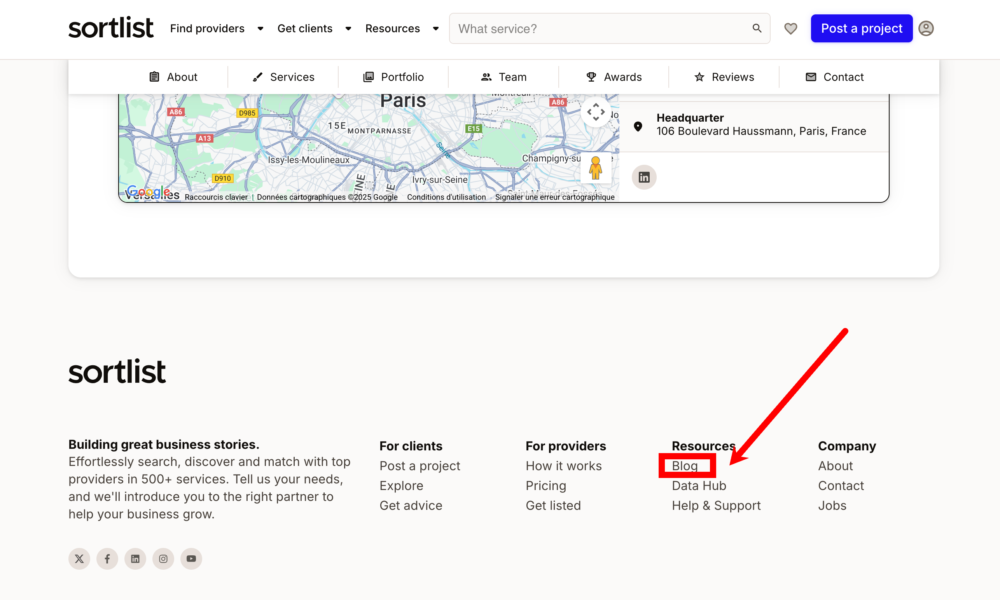

# Fix 301 redirect on footer blog link

## Description
The footer link to the blog (`https://www.sortlist.com/blog`) currently triggers a 301 permanent redirect to `https://www.sortlist.com/blog/` (with trailing slash). This affects all pages using this footer and causes unnecessary redirect chains, diluting PageRank and slightly impacting SEO and user experience.

> **Note:** Even if the link is obfuscated (e.g., via JavaScript or base64), Google Chrome and search engines can still detect and follow the redirect. This means PageRank is still lost for nothing, and the redirect chain remains visible to crawlers.

## Recommendation
1. Update the footer link to use the canonical URL with trailing slash: `https://www.sortlist.com/blog/`.
2. Ensure all future links (in code, CMS, etc.) use the trailing slash version.

### Example of the current issue
- **Status Code:** 301
- **URL:** https://www.sortlist.com/blog
- **Redirect Type:** permanent
- **Redirect URL:** https://www.sortlist.com/blog/
- **Final Status:** 200

### Visual example

*Footer link to the blog currently triggers a 301 redirect (even if obfuscated, Google will see and follow it)*

