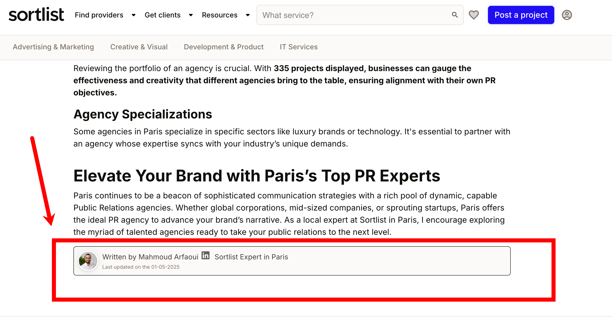

# Fix 301 redirect on LinkedIn author links

## Description
The LinkedIn button for author profiles on many Sortlist pages points to LinkedIn URLs that trigger a 301 permanent redirect. While LinkedIn handles the redirect correctly, it is best practice to link directly to the canonical (final) URL to avoid unnecessary redirect chains, preserve PageRank, and improve user experience. This issue affects thousands of pages.

> **Note:** Even if the LinkedIn link is obfuscated or opened in a new tab, search engines and browsers will still follow the redirect, causing a small but unnecessary loss of SEO value and a slower user experience.

## Recommendation
1. Update all LinkedIn author links to use the final, canonical URL (the one after all redirects).
2. Ensure future links (in code, CMS, etc.) use the canonical version.

### Example of the current issue
| Type      | Source Page URL                                      | LinkedIn Destination URL                                 | Status Code | Status            |
|-----------|------------------------------------------------------|---------------------------------------------------------|-------------|-------------------|
| Hyperlink | https://www.sortlist.com/i/event/berlin-de           | https://www.linkedin.com/in/ray-bayings-0b2696186        | 301         | Moved Permanently |
| Hyperlink | https://www.sortlist.com/i/public-relations/paris-fr | https://www.linkedin.com/in/mahmoud-arfaoui              | 301         | Moved Permanently |

### Visual example

```html
<div class="flex layout-column lh-3">
  <span class="text-secondary-700 small" style="display:flex;align-items:center">
    Written by Mahmoud Arfaoui
    <a href="https://www.linkedin.com/in/mahmoud-arfaoui" target="_blank" rel="noopener noreferrer" style="margin-left:4px;margin-right:8px">
      
    </a>
    Sortlist Expert in Paris
  </span>
  <span class="text-secondary-500 smaller">Last updated on the 01-05-2025</span>
</div>
```
*Example of the LinkedIn author button with a 301-redirecting link*


*Example: LinkedIn author link triggers a 301 redirect*

## Why fix?
- Reduces unnecessary redirects
- Preserves and consolidates PageRank (even for obfuscated links)
- Improves SEO and crawl efficiency
- Slightly improves user experience (faster navigation) 