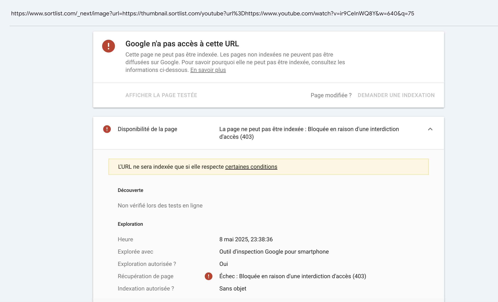

# Googlebot blocked (403) from accessing Next.js image optimization URLs

## Description

Googlebot is encountering HTTP 403 Forbidden errors when attempting to access URLs generated by the Next.js image optimization service (those starting with `/_next/image?...`). This prevents Google from crawling and potentially indexing these optimized image versions. This can lead to errors in Google Search Console's "Page Indexing" reports for these specific image URLs and may hinder Google's ability to fully process images for search results.

## Evidence

The following screenshot from Google Search Console illustrates the issue, showing a `/_next/image` URL that Googlebot cannot access due to a 403 error. The message indicates "La page ne peut pas être indexée : Bloquée en raison d'une interdiction d'accès (403)" (Page cannot be indexed: Blocked due to access denial (403)).

*The specific URL inspected in the screenshot is: `https://www.sortlist.com/_next/image?url=https%3A%2F%2Fthumbnail.sortlist.com%2Fyoutube%3Furl%3Dhttps%3A%2F%2Fwww.youtube.com%2Fwatch%3Fv%3Dir9CeInWQ8Y&w=640&q=75`*

## SEO impact

- **Reduced Image Indexing**: Google may not be able to see, crawl, or index the optimized versions of images served via `/_next/image`, potentially impacting visibility in Google Images.
- **Google Search Console Errors**: This will likely lead to an increase in "Page indexing" errors (specifically, "Blocked due to access forbidden (403)") within Google Search Console for these image URLs.
- **Wasted Crawl Budget**: If these `/_next/image` URLs are linked or referenced in sitemaps or on pages, Googlebot attempting to crawl them and hitting a 403 error is a waste of crawl budget.
- **Indication of Misconfiguration**: A 403 error for Googlebot on these common Next.js paths often points to a misconfiguration in server settings, CDN rules, WAF (Web Application Firewall), or specific bot management rules that are too restrictive.

## Recommendations

1.  **Investigate the Source of the 403 Error**: This is the primary step. Determine why Googlebot (and potentially other legitimate bots) is being served a 403 error for `/_next/image` paths. Potential causes include:
    -   **Firewall/WAF Rules**: Overly aggressive rules might be blocking Googlebot based on its user-agent, IP range, or perceived behavior.
    -   **Server-Level Permissions/Configuration**: Incorrect file/directory permissions or specific server module configurations (e.g., security modules in Apache/Nginx) might be denying access.
    -   **CDN Configuration**: If a CDN is used, it might have its own set of security rules or bot protection features causing the block.
    -   **Rate Limiting or Bot Management Services**: Services designed to block bad bots might be incorrectly identifying Googlebot.
    -   **Next.js Image Loader Configuration**: While less likely to cause a 403 directly from the loader, ensure the `next.config.js` for image `remotePatterns` or `domains` correctly lists the source of external images if the 403 is somehow related to the upstream image fetch failing in a way that triggers a block for the `/_next/image` proxy URL.

2.  **Whitelist Googlebot for `/_next/image` Paths**: Ensure that Googlebot's IP ranges and user agents are explicitly allowed to access all necessary resources, including `/_next/image` paths, in your server, CDN, and firewall configurations.

3.  **Review `robots.txt`**: Although a 403 is a server-level block (not a `robots.txt` disallow), double-check that `/_next/image` is not inadvertently disallowed in your `robots.txt` file, as this could send mixed signals.

4.  **Test with Google Search Console**: After implementing potential fixes, use the "URL Inspection" tool in Google Search Console (testing the live URL) for several of these `/_next/image` URLs to see if Googlebot can now access them successfully.

5.  **Monitor GSC and Logs**: Continuously monitor Google Search Console for any new or recurring 403 errors on these paths and check server logs to confirm Googlebot's access.

---

Resolving this issue will ensure that Google can properly access and process your optimized images, which is important for image SEO and accurate reporting in Google Search Console.
