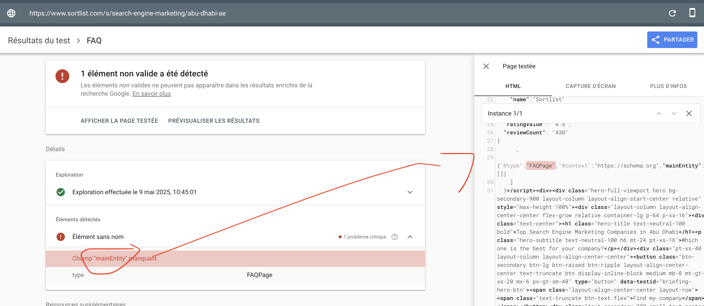

# Fix broken FAQ structured data (`FAQPage`) on service pages

## Problem

Pages like:
```
https://www.sortlist.com/s/search-engine-marketing/abu-dhabi-ae
```
have the following invalid JSON-LD markup:
```json
{
  "@type": "FAQPage",
  "@context": "https://schema.org",
  "mainEntity": []
}
```

Google flags this as invalid because `mainEntity` is **required** and cannot be empty.  
As a result, the page is **not eligible for FAQ rich results**, even though FAQ content exists visually.



---

## Offenders

Here are some examples of pages with this issue:

| URL                                                        | Nom de l'élément   | Dernière exploration   |
|------------------------------------------------------------|--------------------|------------------------|
| https://www.sortlist.com/es/medios/argentina-ar            | Sans objet         | 8 mai 2025             |
| https://www.sortlist.com/s/search-engine-marketing/abu-dhabi-ae | Sans objet         | 8 mai 2025             |
| https://www.sortlist.com/animation/edmonton-ab-ca          | Sans objet         | 8 mai 2025             |
| https://www.sortlist.com/de/design/oesterreich-at        | Sans objet         | 8 mai 2025             |
| https://www.sortlist.com/advertising/kuwait-kw             | Sans objet         | 8 mai 2025             |
| https://www.sortlist.com/es/ux/argentina-ar                | Sans objet         | 8 mai 2025             |
| https://www.sortlist.com/es/s/marketing-b2b/argentina-ar   | Sans objet         | 8 mai 2025             |
| https://www.sortlist.com/fr/s/motion-design/quebec-ca      | Sans objet         | 8 mai 2025             |
| https://www.sortlist.com/animation/winnipeg-mb-ca          | Sans objet         | 8 mai 2025             |
| https://www.sortlist.com/es/innovation/ecuador-ec          | Sans objet         | 8 mai 2025             |

---

## Solution

### Step 1: Inject real question/answer content into the `mainEntity` array

Example of valid JSON-LD:
```json
{
  "@context": "https://schema.org",
  "@type": "FAQPage",
  "mainEntity": [
    {
      "@type": "Question",
      "name": "What are the key performance indicators (KPIs) for measuring the success of a Search Engine Marketing campaign in Abu Dhabi?",
      "acceptedAnswer": {
        "@type": "Answer",
        "text": "Measuring the success of a Search Engine Marketing (SEM) campaign in Abu Dhabi requires a comprehensive approach..."
      }
    },
    {
      "@type": "Question",
      "name": "How can businesses in Abu Dhabi effectively integrate local search strategies into their overall Search Engine Marketing approach?",
      "acceptedAnswer": {
        "@type": "Answer",
        "text": "Integrating local search strategies into your SEM approach is crucial for businesses in Abu Dhabi to stand out. This includes optimizing for 'near me' queries..."
      }
    },
    {
      "@type": "Question",
      "name": "What emerging technologies and trends are shaping the future of Search Engine Marketing in Abu Dhabi, and how can local businesses prepare for these changes?",
      "acceptedAnswer": {
        "@type": "Answer",
        "text": "Several trends like AI, voice search, and mobile-first indexing are transforming SEM in Abu Dhabi. Businesses should optimize for mobile, use AI tools, and publish high-quality content..."
      }
    }
  ]
}
```

### Step 2: Only render the `FAQPage` schema when `mainEntity` contains at least one question

Don't include an empty schema.

---

## SEO Benefit

- Eligibility for rich results
- Better click-through rates in SERP
- Structured content better understood by Google

