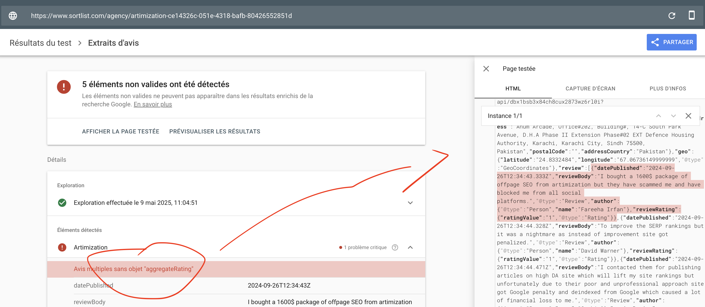

# Fixing review rich snippets: adding `aggregateRating`

## What's the issue I found?



I've noticed that on your agency profile pages where you showcase multiple client reviews, a small but important piece of code called `aggregateRating` is missing. Think of it as a summary scorecard for all the reviews on a page. Google actually looks for this summary when you have more than one review, and it's key for getting those eye-catching star ratings in search results.

**Here's an example of a page I looked at:**
```
https://www.sortlist.com/agency/artimization-ce14326c-051e-4318-bafb-80426552851d
```

**Why is this a big deal?** Well, without this `aggregateRating`, Google Search Console might flag errors (you might see something like "Multiple reviews without 'aggregateRating'"). More importantly, it means your pages won't be eligible for those valuable star ratings in search results. This can unfortunately lead to fewer people noticing your listings and clicking through to your site.

---

## A quick look at the current setup

So you can see what I mean, here's a simplified version of how your review information (what we call "structured data") currently looks when there are several reviews on a page. Notice that the overall summary (`aggregateRating`) isn't there:

```json
"review": [
  {
    "@type": "Review",
    "author": { "@type": "Person", "name": "Fareeha Irfan" },
    "datePublished": "2024-09-26",
    "reviewBody": "I bought a 1600$ package of offpage SEO...",
    "reviewRating": { "@type": "Rating", "ratingValue": "1" }
  },
  {
    "@type": "Review",
    "author": { "@type": "Person", "name": "David Warner" },
    "reviewRating": { "@type": "Rating", "ratingValue": "1" },
    "reviewBody": "It was a nightmare..."
  }
  // ... and so on for other reviews
]
```
The good news is that how you're marking up each individual review is perfectly fine! The only missing piece is that overall `aggregateRating` when you've got more than one review.

---

## Here's how we can fix it

To get this sorted, we'll need to add an `aggregateRating` section to the main technical information (schema) for your agency pages. This new section will neatly summarize all the individual reviews.

**Here's what it should look like:**
```json
"aggregateRating": {
  "@type": "AggregateRating",
  "ratingValue": "4.5", // This will be the average score from all your reviews
  "reviewCount": "5"    // And this will be the total number of reviews
},
"review": [
  // ... your individual reviews will still be listed here, just like before
]
```

---

## Our game plan

Here's what I recommend we do:

1.  **Keep the Individual Reviews As Is:** No changes needed for how each separate review is currently set up. That's all good.
2.  **Add the `aggregateRating`:** For every agency profile page that has multiple reviews, we'll add this new `aggregateRating` block.
3.  **Make Sure It's Always Accurate:**
    -   The `ratingValue` needs to be automatically calculated – it should always show the current average rating based on all the reviews.
    -   Similarly, the `reviewCount` needs to automatically update to show the total number of reviews displayed on that page.

---

## Why this fix matters for your SEO

Getting this `aggregateRating` in place will bring some really positive results:

-   **No more search console errors:** This will clear up those validation errors, which helps Google see your site as well-maintained and technically sound.
-   **Unlock star ratings (rich snippets):** This is the big one! It makes your pages eligible for those star ratings that you see directly in Google search results. These stars can really make your listings pop, grab attention, and significantly increase the number of people clicking through to your site.
-   **Boost trust and credibility:** When Google sees this clear summary of customer satisfaction, it can build trust. This not only helps users feel more confident but can also have a positive knock-on effect on your rankings.

---

## Pages we know are affected (examples)

This is something that will likely improve quite a few of your pages. We'll need to do a full check, but here are a couple of examples I've already spotted:

| URL                                                                 | Agency Name        | Last Checked   |
|----------------------------------------------------------------------|--------------------|----------------|
| https://www.sortlist.com/agency/artimization-ce14326c-051e-4318-bafb-80426552851d | Artimization       | May 8, 2025    |
| https://www.sortlist.com/agency/anxiety-care-online                 | Anxiety Care Online| May 5, 2025    |

We should definitely audit to find all similar pages to ensure they all get this upgrade.

