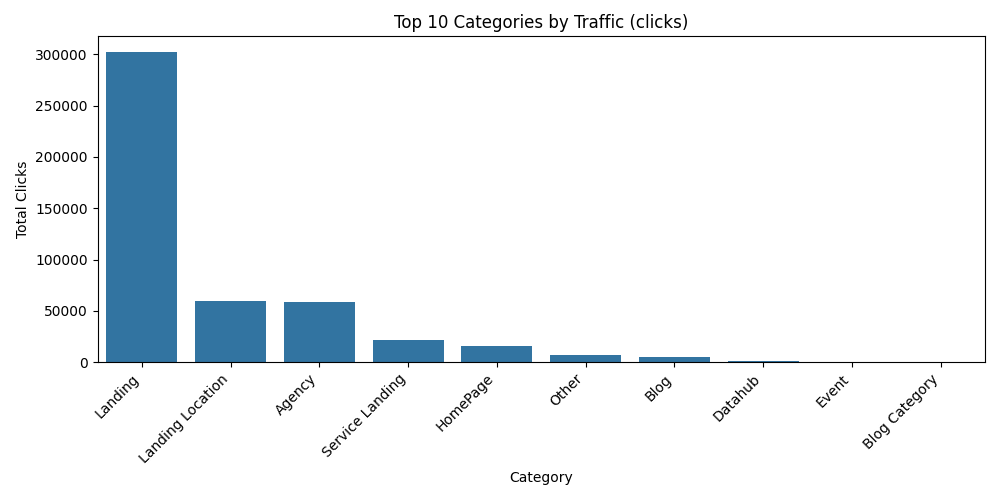
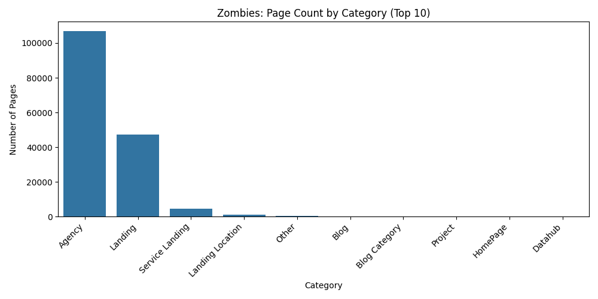

# Improve Internal Linking & PR Distribution for Agency Pages

## Description

Agency profile pages (`/agency/...`) represent the deepest level of the site's hierarchy and are crucial for user conversion. However, current analysis indicates they suffer from poor internal PageRank (PR) distribution and constitute the largest category of "zombie pages" (pages with minimal organic traffic despite being indexed). While `/agency/` is a top traffic category overall, improving internal linking to these valuable pages is critical to reduce orphans, enhance visibility, and leverage their inherent potential. Addressing pagination issues as outlined in [fix_pagination_canonical_noindex.md](./fix_pagination_canonical_noindex.md) will also directly contribute to better PR distribution towards these deeper pages.

## Evidence & data

1.  **Low PageRank Distribution**: Analysis of internal PR flow (`/Volumes/T7/sortlist/sortlist-analyzer/reports/pr_analysis.xlsx`) reveals that agency pages generally receive low PR scores compared to shallower pages, hindering their ability to rank independently and pass authority.
2.  **Significant Traffic Category**: Despite PR challenges, agency pages collectively represent the 3rd highest traffic-driving category, indicating strong user interest and search demand.
    
3.  **High Zombie Page Count**: Agency pages account for the highest number of zombie pages on the site, suggesting many are poorly linked internally, difficult for users and search engines to discover, and receive little to no organic traffic individually.
    

## Recommendation: Implement internal linking module on agency pages

To improve PR distribution, reduce orphan pages, and increase the visibility of valuable agency profiles, implement a dynamic internal linking module on each `/agency/` page. This module should feature two types of links:

1.  **Related Agencies (5 links)**:
    *   **Criteria**: Link to 5 other agency pages that share the **same primary service AND the same primary location** as the current page.
    *   **Selection**: Randomly select from the pool of matching agencies to ensure variety over time.
    *   **Goal**: Strengthen topical clusters and improve discoverability within specific service/location niches.

2.  **Strategic Links (3 links)**:
    *   **Criteria**: Link to 3 other agency pages based on strategic goals, requiring a "smart rule". This rule should aim to boost pages that need more visibility. Potential criteria include:
        *   Agencies with very low calculated internal PR.
        *   Agencies identified as orphaned or having few incoming internal links.
        *   Agencies in service/location combinations with few providers (to distribute PR to underserved sections).
        *   *The exact logic for the "smart rule" needs further definition based on available data and strategic priorities.*
    *   **Goal**: Distribute PR more effectively across the site, rescue orphaned pages, and support agencies in less dense categories.

**Placement**: These links should appear in a clearly labelled section (e.g., "Related Agencies", "Discover Other Agencies") on the agency profile page, ensuring they are crawlable HTML links.

## Opportunity & justification

Agency pages are fundamentally important to Sortlist's business model. Analysis derived from scripts in `/Volumes/T7/sortlist/sortlist-analyzer/src` likely indicates that these pages are high-converting or directly represent the core "product" inventory. Improving their SEO performance through better internal linking directly impacts core business objectives by:

-   Increasing the visibility and organic traffic of individual agency profiles.
-   Reducing the number of underperforming "zombie" pages.
-   Distributing PageRank more effectively throughout the deepest levels of the site.
-   Enhancing user navigation and discovery of relevant agencies.
-   Improving search engine crawling and understanding of the site structure.

Furthermore, the `/agency/` category represents a significant pool of untapped potential, as highlighted by the "Opportunities" metric:

-   **Opportunity Definition**: Pages flagged as "Opportunities" are those with **above-median PageRank or Weighted PageRank** (indicating existing authority or potential) but generating **very few clicks (<10)**. They represent authority that isn't translating into traffic.
-   **Agency Pages as Key Opportunities**: While the specific chart isn't included here due to relevance to the primary topic, analysis often shows the `/agency/` category contains a high number of these opportunity pages. Targeting these pages with better internal linking and potential content/UX improvements is a high-potential strategy to convert existing PR into tangible organic traffic.
    *Note: The chart `Opportunities_count_Category.png` (available in `/Volumes/T7/sortlist/sortlist-analyzer/reports/charts/`) quantifies this opportunity count per category.*

## Expected benefits

-   Improved internal PageRank flow to `/agency/` pages.
-   Significant reduction in orphaned agency pages.
-   Increased indexation and organic visibility for a larger number of agency profiles.
-   Better crawl efficiency for search engines.
-   Potential improvement in rankings for agency-specific queries.
-   Enhanced user experience through better agency discovery. 