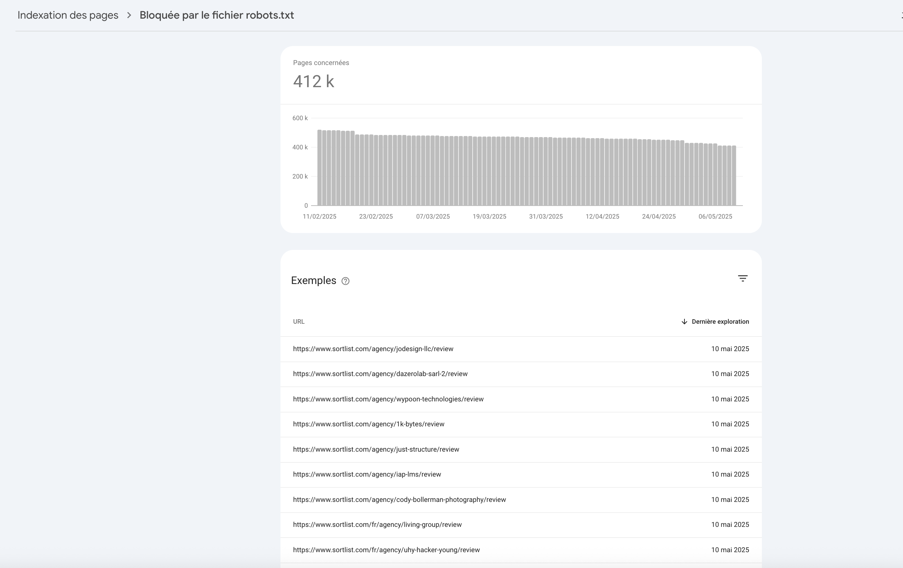
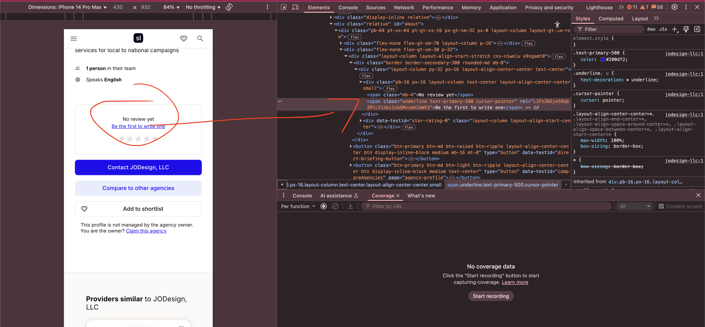

# Review page discovery & link obfuscation concerns

## Description

This ticket addresses the discoverability of agency review pages (e.g., `/agency/[slug]/review`) by Google, despite potential obfuscation efforts. It also outlines a cautious perspective on link obfuscation (cloaking).

Personally, I advocate for minimal use of cloaking. If implemented, links must be thoroughly isolated to be undiscoverable by Google . For large websites, the risk-to-benefit ratio of cloaking is often questionable due to implementation complexities and potential negative SEO impacts if detected.

## Evidence & observations

1.  **Review pages discovered by Google**:
    Google is discovering and attempting to index agency review pages. This might stem from ineffective cloaking, past sitemap inclusions, stray internal links, or manual submissions.
    
    *Caption: Google processing a `/review` page.*

2.  **Obfuscated links potentially discoverable**:
    Links to review sub-pages on agency profiles (e.g., `https://www.sortlist.com/agency/jodesign-llc`) appear obfuscated in the direct HTML, but the destination URL (`/agency/[slug]/review`) can often be found within client-side JavaScript bundles (e.g., `/_next/static/chunks/pages/agency/%5Bslug%5D-13bee1a6d55e3667.js`).
    
    *Caption: HTML structure of the obfuscated link.*

    *JS Snippet Example (illustrating discoverable review path):*
    ```javascript
    // ...
    ("span",{className:"mb-4",children:E("agency:profile.about.details.noReview")}),(0,l.tZ)(Z.s,{className:"underline text-primary-500",href:`/agency/${M}/review`,obfuscate:!0,children:E("agency:profile.about.details.reviewFirstCta")})]
    // ...
    ```
    This implies that even if the `<a>` tag is manipulated, the true path remains discoverable.

## Discussion on cloaking & alternative discovery vectors

Imperfect cloaking carries risks of indexing issues or search engine penalties. Google might also discover these "hidden" URLs via:
*   Old or cached sitemaps.
*   Temporary JavaScript-injected links (e.g., during A/B tests).
*   Exposure in crawlable external files (RSS feeds, JSON-LD, external JS/JSON configs).

**Conclusion on Obfuscation**: While search engines, particularly Googlebot, are increasingly sophisticated at rendering JavaScript and discovering content, it remains theoretically possible that highly complex obfuscation techniques or link generation triggered by very specific user interactions (not easily replicable by bots) might go undetected, at least temporarily. However, the effort to maintain such systems against evolving crawler capabilities, and the inherent risks of being flagged for deceptive practices, generally outweigh the potential short-term benefits for most production websites.

## Recommendations

1.  **Assess obfuscation effectiveness**: Determine if the current method for `/review` pages truly prevents PR flow or crawling, given their discoverability.
2.  **Clarify indexing strategy**: Decide if `/review` pages should be indexed. 
    *   **If NO**: Robustly block via `robots.txt`, remove all internal links (HTML or JS), and exclude from sitemaps.
    *   **If YES**: Ensure they are technically sound, valuable, properly linked (consider `nofollow`), and have correct canonicals.
3.  **Audit sitemaps**: Ensure all sitemaps accurately reflect the desired indexation status for all page types.
4.  **Prioritize server-side rendering for critical links**: Navigational links important for SEO should be standard `<a>` tags in server-rendered HTML. Implement server-side access control (auth, token) if needed for certain resources, rather than relying solely on client-side obfuscation.
5.  **Investigate Google's discovery path**: Use GSC URL Inspection to find how Google discovers `/review` URLs intended to be hidden.

## Expected benefits

*   Improved control over Google's indexing.
*   More efficient crawl budget use.
*   Reduced risk from imperfect cloaking.
*   Better understanding of internal link equity flow.

