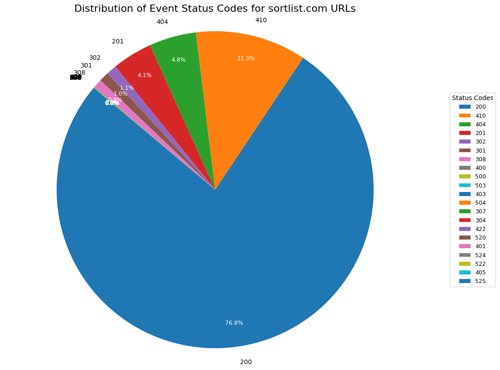

# Prevent API endpoint exposure and indexing from frontend-rendered state

## Description

Currently, internal API routes such as `/api/query/agency-services` are being exposed in the frontend-rendered HTML (likely via JavaScript state hydration such as React Query or similar).

These URLs are being **discovered and crawled by Googlebot**, as confirmed in server logs, frequently resulting in HTTP `410 Gone` responses. Analysis of recent server logs indicates that a notable portion of requests to Sortlist URLs encountered by search engine bots result in a 410 status, with many of these pertaining to exposed API endpoints.

The pie chart below, derived from log analysis, illustrates the distribution of status codes encountered by bots on `sortlist.com` URLs, highlighting the prevalence of 410 errors (around 11% of logged hits in the analyzed sample):



## Evidence

### Crawling logs: High volume of 410 responses from Googlebot for API URLs

Beyond isolated examples, a pattern of API URLs returning 410 errors is evident. These should never be indexed, yet Googlebot finds and attempts to access them. Here are some examples from server logs:

| Event Datetime (approx.) | Event URL                                                                                                | Status | Bot Name          |
|--------------------------|----------------------------------------------------------------------------------------------------------|--------|-------------------|
| 2025-03-01               | `https://www.sortlist.com/api/query/agency-competitors/andra-arnold-associates-guelph-realtors?locale=de&...` | 410    | google_smartphone |
| 2025-03-01               | `https://www.sortlist.com/api/query/agency-competitors/dot-analytics?locale=es&v=1.2`                      | 410    | google_smartphone |
| 2025-04-01               | `https://www.sortlist.com/api/query/work/mamma-soup-and-lifestyle--mamma-soup--marketing-advertising?lo...`  | 410    | google_smartphone |
| 2025-04-01               | `https://www.sortlist.com/api/proxy/public-api/languages`                                                  | 410    | google_smartphone |
| 2025-04-01               | `https://www.sortlist.com/api/query/work/a-la-petite-commission-refonte-de-site--a-la-petite-com...`      | 410    | google_web_search |
| 2025-04-01               | `https://www.sortlist.com/api/query/work/advocate-getter--advocate-getter--legal-services?locale=de&v=1.6.8` | 410    | google_smartphone |
| 2025-04-01               | `https://www.sortlist.com/api/query/work/aisle-branding-retail-shop--food?locale=en&v=1.6.8`                 | 410    | google_smartphone |
| 2025-04-01               | `https://www.sortlist.com/api/query/work/alex-form-3d-production--alex-form--energy-oil?locale=en&v=1.6.8`    | 410    | google_web_search |

*(Note: The `event_datetime` in the table above is approximate based on the provided screenshot, and `...` indicates truncated URLs for brevity in this ticket. Full URLs are in the logs.)*

### URLs exposed in frontend-rendered code
Within the source HTML of live pages, we observe JSON like the following (visible without interaction):

```json
"queryKey": [
  "dem-diseno-estrategico-de-marca-en-/api/query/agency-services"
],
"queryHash": [
  "[\"dem-diseno-estrategico-de-marca-en-/api/query/agency-services\"]"
]
```

Also present:
```json
"works": {
  "count": 1,
  "data": [
    {
      "name": "Drinko Bebida hidratante",
      "slug": "drinko-bebida-hidratante--drinko--bebidas",
      "attachment": {
        "url": "https://sortlist-core-api.s3.eu-west-1.amazonaws.com/u9x6ds7rttc67f0bhuc1ulqpc8uz"
      }
    }
  ]
}
```

This confirms that internal state, including internal routes and slugs, is fully exposed in initial HTML render, making it discoverable to crawlers.

## SEO Risks

- Crawl budget wasted on API routes
- Appearance of 410 in index coverage report
- Potential leakage of private/internal endpoints
- Polluted index and Search Console errors
- Duplicate content or near-empty pages indexed via API responses

## Recommendations

1. **Avoid exposing API URLs (`/api/...`) in HTML-rendered JSON**:
   - Review how data hydration works (e.g., React Query + Hydrate) and avoid serializing internal endpoints.
   - Obfuscate or clean `queryKey` or `dehydratedState` before embedding.

2. **Block `/api/` in `robots.txt`**:
   ```txt
   User-agent: *
   Disallow: /api/
   ```

3. **Harden API access**:
   - Require authentication or token access where appropriate.
   - Return `401 Unauthorized` or `404` instead of `410` if these routes should never be exposed to bots.

4. **Clean up Search Console errors**:
   - Remove unwanted endpoints via the "Removals" tool if needed.
   - Monitor future crawl activity via logs, paying special attention to 410s on `/api/` paths.

---

Fixing this ensures a cleaner index, protects internal logic, and improves crawl efficiency across Sortlist domains.


## Summary: Mixed HTTP status responses for deprecated API URL

## Context

The API endpoint:
```
https://www.sortlist.com/api/query/agency-competitors/dot-analytics?locale=es&v=1.2
```
is returning inconsistent status codes depending on the request type, which leads to confusion in SEO tools like Google Search Console.

## Status Behavior Summary

| Access method                        | HTTP status | Interpretation                                         |
|-------------------------------------|-------------|--------------------------------------------------------|
| `curl -A "Googlebot"`               | **410 Gone** | Correct SEO signal — URL permanently removed           |
| `curl` (default User-Agent)         | **403 Forbidden** | Blocked by WAF/CDN (likely Cloudflare challenge)     |
| Google Search Console (URL Inspect) | **404 Not Found** | Fallback or inconsistent behavior in test context     |

---

## Example Response Headers

### `curl -A "Googlebot"`
```http
HTTP/2 410
content-type: application/json; charset=utf-8
cache-control: public,max-age=14400,s-maxage=14400
```

### `curl` default
```http
HTTP/2 403
content-type: text/html; charset=UTF-8
cf-mitigated: challenge
cache-control: private, no-store
```

---

## Recommendation

- Ensure `/api/` routes are excluded in `robots.txt`:
  ```txt
  User-agent: *
  Disallow: /api/
  ```

- Avoid exposing API URLs in rendered HTML or JS state (`dehydratedState`, `queryKey`)
- No need to fix the 404 in Search Console as long as Googlebot is getting 410
- Use `410` for clear deprecation signals — you're doing the right thing

